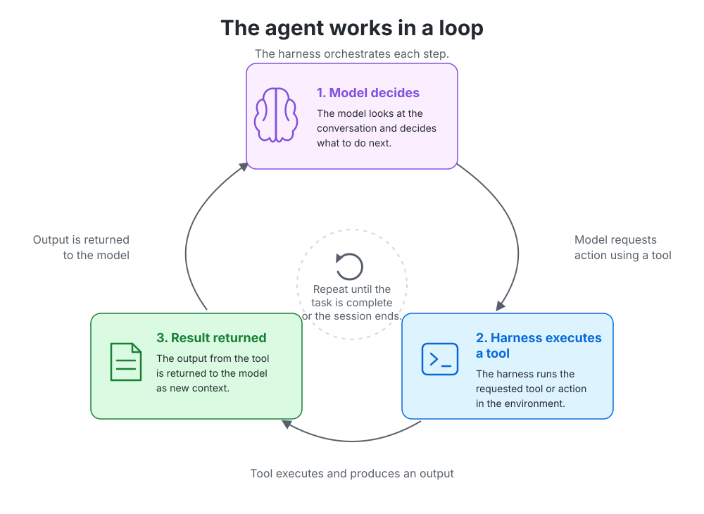

# A coding agent is more than a model

In the previous article, two coding agents used the same model to perform the same task.

They worked from the same repository and commit. They received the same prompt. They started in fresh sessions. Their answers were of comparable quality.

But one cost almost three times as much as the other.

If the model was the same, what changed?

The answer is everything around it.

A coding agent is not just a model with access to a codebase. It is a model operating inside a **harness**: the system that briefs it, equips it, runs its tools, manages its memory, decides what context to preserve, and determines how much freedom it has to act.

The model supplies the underlying capability.

The harness turns that capability into a product.

<figure>
  
  <figcaption>
    A coding agent is the model plus the system built around it.
  </figcaption>
</figure>

That distinction matters because we often explain agent behavior with the model name alone.

We say one agent is more cautious, another is faster, a third is better at exploring repositories. But those differences may come from what the model was told, which tools it received, how the work was divided, or what the user had configured—not from the model weights themselves.

To understand a coding agent, you have to look at the whole system.

---

## The conversation begins before your prompt

When you type a short request, it can feel as though the model receives only those words.

It does not.

By the time the model begins your task, the harness may already have told it:

- what role it should play
- how autonomous or cautious it should be
- which tools it may call
- how those tools should be used
- what repository and environment it is operating in
- which instructions, memories, or skills are available
- what has happened earlier in the conversation

Before the model sees the task, the harness has already described who it is, what it can do, and what world it is working inside.

I call the amount present on the first model request the **first-call context footprint**. This is not the model's context window, which is the maximum amount it can hold. It is the amount of that capacity already occupied when useful task work begins.

In matched baseline captures, the same Claude Sonnet model started with roughly 16,000 tokens of context in one harness and close to 30,000 in another.

That difference is not a leaderboard.

A smaller footprint can mean less fixed overhead and more room for the task. It can also mean less guidance and less awareness of the environment.

A larger footprint can mean richer capabilities and more consistent behavior. It can also contain information the current task does not need.

The useful question is not:

> Which harness sends fewer tokens?

It is:

> What was loaded, what value did it provide, and what tradeoff did it create?

### The job description

System instructions act like the agent's job description.

They can tell the model to proceed autonomously, ask before risky operations, prefer specific tools, keep answers brief, explain its reasoning, or focus on implementation rather than discussion.

These instructions shape the agent's posture.

A read-only repository explanation may benefit from an agent that moves quickly without interrupting. A production deployment may benefit from the opposite: explicit confirmation, stronger guardrails, and a bias toward caution.

What looks like model confidence may actually be product policy.

> Autonomy is not only a model trait. It is also a harness setting.

### The toolbox

A model cannot call a tool it has not been told about.

Before it can use a terminal, search a repository, edit a file, open a browser, or reach an external system, the harness must describe that capability. Tool names, descriptions, parameters, and schemas become part of the model's working context.

The harness therefore decides:

- which tools exist
- how narrowly or broadly they are scoped
- how much guidance each tool carries
- whether tools are available immediately or loaded when needed

A large tool catalog can make an agent more capable. It can also make tool selection harder and increase the amount of context carried into every request.

A smaller catalog can be easier to navigate. It may also force the model to improvise through more general-purpose tools.

The model's intelligence is the same. The world available to it is not.

### The briefing folder

Repository instructions, memory, skills, workspace state, and prior conversation all form a kind of briefing folder.

An agent that already knows the build command, test strategy, directory structure, and architectural conventions may avoid a great deal of exploration.

But that briefing can also be stale, irrelevant, contradictory, or simply too large.

This is why repository instruction files are not just documentation. They become part of the agent's operating environment.

It is also why two benchmark runs are not equivalent when one starts with repository guidance, persistent memory, or extra skills and the other does not.

The question is not whether that context costs tokens. It does.

The question is whether it saves more work than it adds.

---

## The harness runs the loop

The harness does not stop shaping the agent after the first request.

A coding agent typically works in a loop:

<figure>
  
  <figcaption>
    The model decides, the harness executes a tool, the result returns as new context — and the loop repeats.
  </figcaption>
</figure>

That loop may repeat a few times or continue for dozens of turns.

The harness decides how the loop is organized.

Imagine the agent needs to inspect six unrelated files.

It could request all six at once.

Or it could read one file, study the result, and then decide what to inspect next.

The first approach uses fewer model round-trips. It may also read files that turn out not to matter.

The second can adapt after every result. It also makes more calls and repeatedly brings the system instructions, tools, and accumulated conversation back into the next request.

Neither strategy is universally better.

Batching is attractive when tasks are independent and predictable. Sequential work is useful when each result changes the next decision.

The important point is that the harness influences the rhythm.

> The harness does not only prepare the first call. It shapes every call after it.

### Caching changes the economics, not the behavior

Most model providers support prompt caching.

When a request begins with the same system instructions, tool definitions, and other stable context as a previous request, those tokens can often be reused at a lower cost instead of being processed from scratch.

The harness has a significant influence on how effective that reuse becomes. A well-structured harness tends to place stable information at the beginning of the context and append new conversation turns at the end. That keeps a large portion of each request reusable as the session grows.

Caching can dramatically reduce the cost of repeated context. It does not change what the model sees, which tools it uses, or how many times the harness calls the model.

That distinction matters.

A harness with excellent cache reuse can still be expensive if it starts with a large context footprint or makes many model calls. Likewise, a harness with lower cache reuse can still be efficient if it keeps conversations short and focused.

Cache statistics are therefore best viewed as an economic metric, not a quality metric. They help explain cost, but they do not explain behavior.

### Long sessions force difficult choices

As a session grows, the harness has to decide what to keep.

It can:

- carry the complete conversation forward
- summarize older turns
- compact large tool results
- discard information it considers irrelevant
- save selected facts into memory
- delegate work to another agent with a fresh context

Every option trades continuity against size.

Keep everything, and the conversation becomes expensive and crowded.

Compress too aggressively, and something important may disappear.

Delegate to a subagent, and the work may become easier to parallelize—but context must be transferred, results reconciled, and possibly another model selected.

These are product and orchestration decisions around the model.

They are part of what developers experience as “the agent.”

---

## There is no single owner of the agent

It is tempting to talk about Copilot, Claude, or any other coding agent as though the product were one fixed thing.

In practice, the working system is assembled by several layers — each owned by someone different.

<figure>
  
  <figcaption>No one party owns the agent. The provider supplies the capabilities, the product builds the harness, and the user configures the environment — and the task you give it does the rest.</figcaption>
</figure>

The model provider supplies the raw capabilities. The product team builds the harness around them. And the user or administrator configures the environment the agent runs in.

And then there is the task itself.

A vague request such as “improve this repository” leaves room for exploration, interpretation, delegation, and style.

A precise request such as “fix this off-by-one error in this function” leaves much less room for the harness to express preferences.

So observed behavior is the sum of all of them: model, harness, configuration, and task together. That is why comparing product names alone is not enough.

A benchmark is comparing configured systems running particular tasks.

---

## Capability has a context cost

MCP makes this especially visible.

Connecting an MCP server can give an agent access to GitHub, a filesystem, a browser, databases, cloud systems, or internal company services.

That can transform what the agent is able to do.

It also adds tools and context.

This does not make MCP inefficient. It means an MCP-enabled agent is a different system from the same product with MCP disabled.

The same is true of installed extensions, repository instructions, memory, skills, and IDE state.

More capability may be exactly what the task requires.

But it should not be treated as free, and it should not be hidden when systems are compared.

> Configuration is part of the agent.

---

## The same choice can help one task and hurt another

Harness choices are not switches between good and bad. They are tradeoffs.

Consider two requests.

The first is:

> Explain this repository to a new developer.

For that task, a lean starting context, aggressive batching, and a high degree of autonomy may produce a fast and useful result.

The second is:

> Update the production deployment configuration and apply it.

Now the value of explicit confirmation, richer policy guidance, and stronger guardrails changes completely.

The autonomous behavior that felt efficient in the first task may be risky in the second.

The sequential workflow that looked expensive during a read-only explanation may be exactly what you want when every action depends on the previous result.

The best harness design therefore depends on what the agent is being asked to do.

It also depends on how much room the task leaves for the harness to matter.

Open-ended work gives the harness space to influence exploration, presentation, delegation, and caution.

Tightly constrained work leaves less room for those choices to appear.

---

## Ask about the system, not only the model

The model name still matters.

It is just not enough to explain the result.

When evaluating a coding agent, ask:

- What was loaded before the task began?
- Which tools, models, and external systems were available?
- How did the harness organize the work?
- What had the user or administrator configured?
- How much freedom did the task leave?

Those questions turn an unexplained winner into an understandable system.

A coding agent is not a model with a text box.

It is a model operating inside a briefing, a toolbox, a workflow, and a configured environment.

The model supplies the capability.

The harness shapes how that capability is presented and used.

The task determines which of those choices have room to matter.

> Two agents can share the same model. The systems using it are still different.

The next article holds the model constant and looks for the harness in the behavior itself: how agents write, how they search, when they delegate, and where their differences disappear.