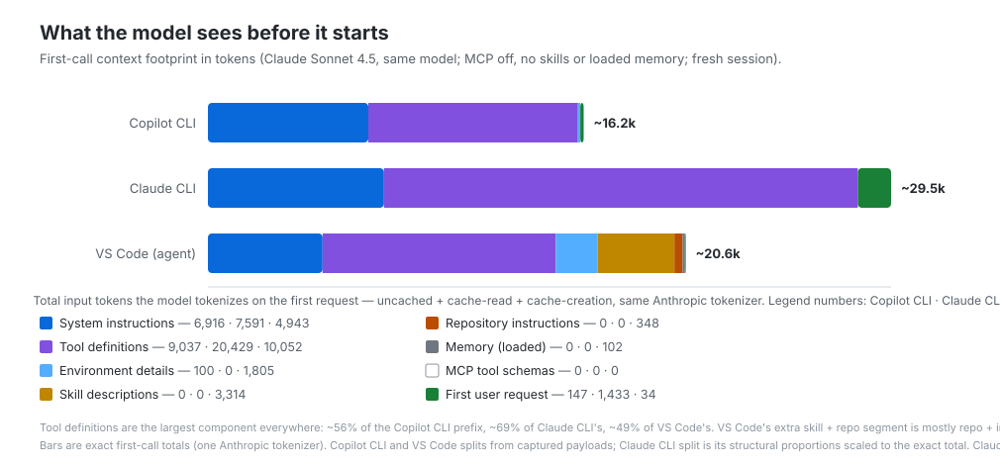
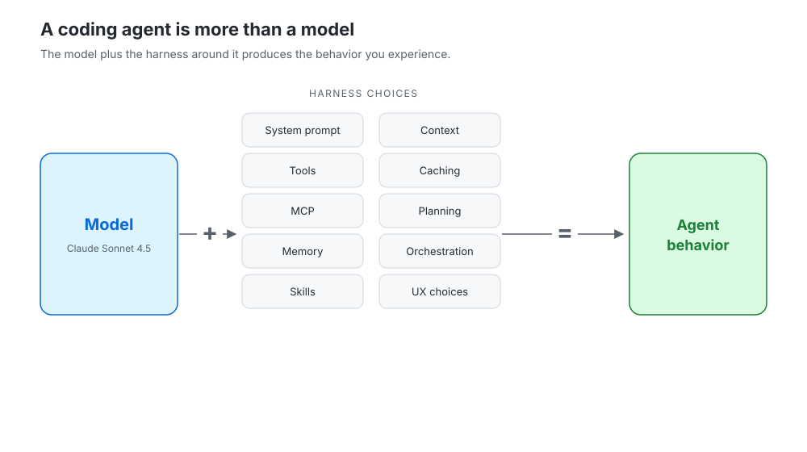
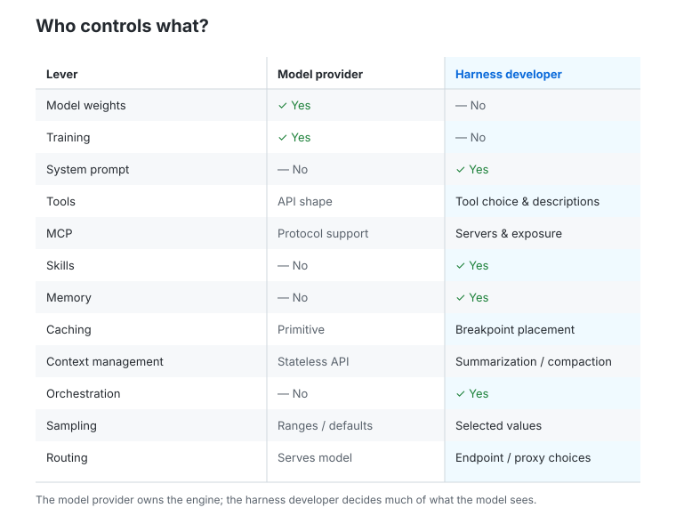
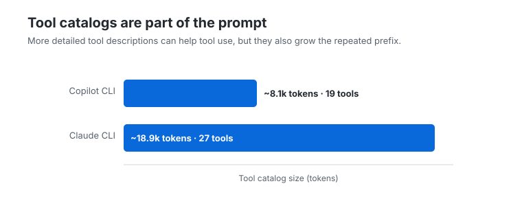
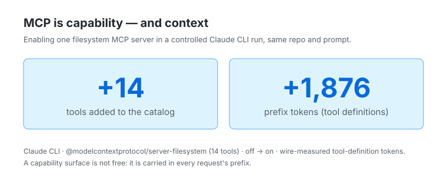

# A coding agent is more than a model

Developers talk a lot about models.

One person says Claude is better at coding. Another says GPT is better at tool use. A third says one coding agent is faster, cheaper, or more autonomous than another.

But when you use a coding agent, you are not interacting with a model directly.

You are interacting with a system built around the model.

That system is the harness.

The harness decides what instructions the model sees, which tools it can call, how much repository context is loaded, how memory works, whether MCP servers are available, how tool schemas are described, how caching is used, when the conversation is compacted, and how much autonomy the agent is encouraged to take.

That means two coding agents can use the same underlying model and still behave very differently.

I wanted to understand how much of the behavior comes from the model, and how much comes from the harness around it. So I looked at several coding-agent harnesses using the same model, the same repository, and the same task.

Same model: Claude Sonnet 4.5.

Same task: explain a repository to a new developer.

Different harnesses.

The result was not that one harness is magical and another is not.

The result was simpler:

> A coding agent is a model plus a stack of product and engineering decisions.

Those decisions matter.

## What I looked at

I looked at three harnesses:

- Copilot CLI
- Claude CLI
- Copilot coding agent in VS Code

The goal was not to benchmark them or rank them.

The goal was to understand what each harness sends to the model, what tools it exposes, how it manages context, and which parts of the experience are controlled by the model provider versus the harness developer.

The same model was used across the captures: Claude Sonnet 4.5.

That matters because it lets us separate two ideas that are often mixed together:

> Is the model different?

and

> Is the system around the model different?

In these captures, the model was the same.

The systems around it were not.

## The first surprise: the model sees very different things

When a developer types a prompt into a coding agent, it can feel like the model sees only that prompt.

It does not.

Before the model starts reasoning, the harness may already have sent a large amount of context:

- system instructions
- tool definitions
- environment details
- repository instructions
- memory
- skill descriptions
- MCP tool schemas
- prior conversation history

That entire payload shapes the model’s behavior.

In the captures, the “before reasoning” payload varied a lot.

```text
Copilot CLI:            ~15k tokens
Copilot in VS Code:     ~17k tokens
Claude CLI:             ~27k tokens
```

Same model.

Same kind of task.

Nearly a 2x difference in what the model sees before it even starts answering.

<figure>
  
  <figcaption>The out-of-box floor, MCP off and no user-added skills: the model was the same, but the pre-reasoning payload ranged from about 15k to 27k tokens. This is the floor — real usage only adds to it.</figcaption>
</figure>

That difference came mostly from harness choices: system prompt size, tool catalog verbosity, IDE context, and how much extra environment information is injected.

These three numbers are the floor — what each harness loads with MCP off, no memory file, and no user-added skills. It is the most portable number I can give you, because everything above it depends on your machine.

And there is a lot that sits above it. The biggest variable, the tool catalog, is partly out of the harness's hands. In an IDE especially, installed extensions add their own tools. The Copilot-in-VS-Code session I captured actually measured about 21k tokens across 56 tools — but 18 of those came from notebook and browser extensions, not from Copilot itself. Strip those extension tools and the floor is roughly 17k (the estimated bar above). Turn MCP on instead and that same harness jumped to about 46k tokens across 95 tools. Add a memory file or a few skills and it grows again.

So the portable, harness-controlled part is really the floor: the system prompt plus the built-in tool set, with MCP off and no extra extensions or skills. Everything above that floor is your environment. The exact number on your machine will differ from mine — which is the whole point.

This is the first important lesson:

> The model is constant. The prefix is not.

## What is a harness?

A coding-agent harness is the software layer that turns a model into a developer tool.

The model predicts text and tool calls.

The harness decides what world the model is operating in.

A simplified coding-agent request looks something like this:

```text
System instructions
+ Tool catalog
+ Environment context
+ Memory
+ Skills
+ MCP tools
+ User prompt
+ Conversation history
= What the model sees
```

That bundle is not neutral.

It tells the model who it is, what it should do, what it should avoid, which tools exist, how autonomous it should be, whether it should ask questions, how it should format answers, and what information is available about the repository and environment.

So when two agents behave differently, the difference may not come from the model at all.

It may come from the harness.

<figure>
  
  <figcaption>A coding agent is a model plus the harness around it: prompts, tools, memory, context, caching, planning, and UX choices.</figcaption>
</figure>

## What the model provider controls

With Claude Sonnet 4.5, Anthropic controls the model.

That includes the model weights, training, the API contract, the safety floor, and the basic mechanisms for things like caching and thinking.

But that does not mean Anthropic controls the whole coding-agent experience.

A lot remains in the hands of the harness developer.

| Lever | Mostly model provider | Mostly harness developer |
|---|---:|---:|
| Model weights | Yes | No |
| Training | Yes | No |
| System prompt content | No | Yes |
| Tool selection | No | Yes |
| Tool descriptions | No | Yes |
| MCP exposure | No | Yes |
| Skills | No | Yes |
| Memory | No | Yes |
| Agent orchestration | No | Yes |
| Cache placement | Partly | Partly |
| Context compaction | No | Yes |
| Sampling values | Range/defaults | Chosen values |
| Model routing | Serves model | Chooses endpoint/proxy |

A simple way to say it is:

> The model provider owns the engine. The harness developer builds the car around it.

<figure>
  
  <figcaption>The model provider owns the engine. The harness developer decides much of what the model sees and how hard it has to work.</figcaption>
</figure>

That car can be tuned in very different ways.

## Lever 1: system prompt and autonomy

The system prompt is one of the biggest behavioral surfaces in a coding agent.

It tells the model what kind of assistant it is supposed to be.

In the captures, the system prompts were not the same.

Copilot CLI leaned toward autonomy. It told the agent to proceed in a non-interactive way and not ask for confirmation.

The Claude CLI leaned more cautious. It included instructions to confirm before irreversible actions.

Neither choice is inherently right or wrong.

They are product choices.

For a read-only task, a more autonomous posture can reduce round trips. The agent can inspect files, form an answer, and continue without asking.

For a risky editing task, a more cautious posture may be exactly what you want. You may prefer an agent that stops before making an irreversible change.

This is why harness comparisons can be tricky.

The same design choice can be a strength in one task and a weakness in another.

## Lever 2: tools

Coding agents do not just answer from memory.

They use tools.

They read files, search directories, run commands, edit code, create plans, call MCP servers, and sometimes delegate work to subagents.

The tool catalog is the list of tools the model can see and call.

In the captures, counting each harness's built-in tools (MCP off, no extensions), the catalogs differed quite a bit.

```text
Copilot CLI:            19 tools
Claude CLI:             27 tools
Copilot in VS Code:    ~38 tools
```

These are built-in floors. The Copilot-in-VS-Code session I captured actually exposed 56 tools, but 18 of those came from installed extensions (notebook and browser), not from Copilot — so the portable number is ~38. MCP and extensions only ever add on top.

The difference was not only the number of tools.

It was also how they were described.

Claude CLI’s tool catalog was much more verbose than Copilot CLI’s. The tool definitions were around 18.9k tokens for Claude CLI versus around 8.1k tokens for Copilot CLI.

<figure>
  
  <figcaption>Claude CLI exposed more tools and a much larger tool catalog than Copilot CLI in this capture.</figcaption>
</figure>

That is a pure harness choice.

More detailed tool descriptions may help the model choose the right tool on the first try. But they also increase the fixed cost of every request, especially because the tool catalog is part of the repeated prefix.

Again, this is not magic.

It is a tradeoff.

```text
Shorter tool descriptions:
  lower token cost
  smaller prefix
  possibly less guidance

Longer tool descriptions:
  higher token cost
  larger prefix
  possibly better tool selection
```

The right answer depends on the task and the product goals.

## Lever 3: MCP

MCP is powerful because it gives the agent access to more capabilities.

It can expose tools for GitHub, Azure, Playwright, filesystem access, internal systems, and much more.

But every MCP server can also add tools to the catalog.

And those tools are not free.

In one clean MCP on/off comparison, adding a single filesystem MCP server added:

```text
+14 tools
+1,876 prefix tokens
```

<figure>
  
  <figcaption>MCP is capability, but also context. An MCP-on run and an MCP-off run are not the same experiment.</figcaption>
</figure>

That was one small server.

Larger MCP configurations can add many more tools.

This matters because an MCP-heavy setup and an MCP-light setup are not really the same test. If one agent has many MCP servers enabled and another does not, you may be measuring configuration more than harness quality.

MCP is one of the easiest ways to change the cost, capability, and behavior of a coding agent.

That is the tradeoff:

```text
More MCP:
  more capability
  more tools
  larger prefix
  more possible distraction

Less MCP:
  smaller prefix
  lower cost
  fewer capabilities
```

So when someone compares two coding agents, one of the first questions should be:

> Which MCP servers were enabled?

## Lever 4: memory

Memory is another harness decision.

Some harnesses keep memory mostly session-scoped. Others support cross-session memory, project memory, user memory, or file-based memory that can be loaded back into the prompt.

Persistent memory can make an agent feel more continuous. It can remember preferences, project details, or feedback from earlier sessions.

But memory can also carry stale facts forward.

It can also add weight to the prompt.

That creates another tradeoff:

```text
Persistent memory:
  more continuity
  more personalization
  risk of stale context
  more prefix weight

Session-only memory:
  cleaner runs
  more predictable behavior
  less continuity
```

For a developer, this matters because two agents using the same model may not actually be seeing the same world.

One may be working from a clean session.

Another may be carrying project memory, user memory, repository instructions, and previous feedback.

Those are not small details.

They can change the result.

## Lever 5: context management

The API is stateless.

That means the harness has to resend the relevant context on each request: system prompt, tools, conversation history, and anything else the model needs.

As the session gets longer, the harness has a choice.

It can keep sending the growing history.

Or it can summarize, compact, or drop parts of the conversation.

That choice affects cost and quality.

In the captures, the harnesses managed history differently. Some showed mostly linear growth. One Claude CLI capture showed a plateau later in the run, which likely indicates compaction or summarization.

Compaction helps long sessions continue.

But it can also drop details.

No compaction is simpler and more predictable.

But it can become expensive.

Again, the harness decides.

## Lever 6: caching

Prompt caching is one of the most important cost levers.

The basic caching primitive comes from the model provider. But the harness decides where to place cache breakpoints and how stable the prefix remains.

In the CLI captures, both harnesses achieved high cache hit rates:

```text
Copilot CLI: 87.2%
Claude CLI:  90.2%
```

That is good engineering on both sides.

It also shows why “raw input tokens” alone can be misleading. A large stable prefix can be much cheaper after caching than it looks at first glance.

But caching only works well when stable content remains stable.

If the tool catalog changes, MCP servers change, memory changes, or the prefix is reorganized, the cache may become less effective.

So caching is not just an API feature.

It is a harness design problem.

## Lever 7: thinking and sampling

Some harnesses explicitly enable thinking with a fixed budget. Others appear to use thinking through a different mechanism. Some IDE captures did not expose the same settings.

The CLI captures also showed a notable max token difference:

```text
Copilot CLI max_tokens: 8,192
Claude CLI max_tokens:  32,000
```

That setting can change behavior.

A larger output budget can let an agent produce longer responses or continue within a single request. It may also make it more willing to keep going.

A smaller budget can encourage tighter responses, but may require more turns for long work.

These are not model differences.

They are harness choices made within the API’s allowed ranges.

## Lever 8: agent orchestration

Modern coding agents are not always a single loop.

Some can create tasks, spawn subagents, enter planning modes, manage worktrees, schedule future work, or call named specialized agents.

The captures showed different orchestration surfaces.

Claude exposed a richer set of orchestration tools, including task tools, worktree tools, monitoring, scheduling, and planning modes.

Copilot CLI used a leaner manager-style approach.

Copilot in VS Code exposed a curated fixed roster of agents.

These choices shape the experience.

A rich orchestration surface can support long-running autonomous workflows.

A smaller surface can be simpler, easier to reason about, and less expensive to expose.

A fixed roster can make the system more predictable.

A dynamic fleet can make it more flexible.

Once again, there is no magic.

There are tradeoffs.

## A worked example: same task, same model, different systems

The cleanest way to see the difference is to look at one ordinary task:

> Explain this repository to a new developer.

Same model.

Same repo.

Same prompt.

Different harnesses.

In the CLI runs, the shape was very different.

| Metric | Copilot CLI | Claude CLI |
|---|---:|---:|
| LLM requests | 7 | 19 |
| Tool calls | 19 | 16 |
| Tool catalog size | ~8.1k tokens | ~18.9k tokens |
| System prompt size | ~6.7k tokens | ~7.0k tokens |
| Cache hit rate | 87.2% | 90.2% |
| Cost | $0.163 exact | modelled estimate |

The important point is not that one number is better.

The important point is that the agents took different paths through the same task.

Copilot CLI carried a smaller tool catalog and proceeded with a more autonomous posture.

Claude CLI carried a larger tool catalog, exposed richer orchestration tools, and took more model turns.

Both used the same model.

The result was shaped by the harness.

## The IDEs add another layer

The IDE captures showed another important pattern.

An IDE is not just a CLI inside a window.

It can add workspace context, repository state, editor state, instructions, skills, MCP tools, and product-specific agent behavior.

The built-in floor for Copilot in VS Code sits only a little above the Copilot CLI:

```text
Copilot CLI:        ~15k tokens
Copilot in VS Code: ~17k tokens
```

But the IDE is where the environment piles on. That same Copilot-in-VS-Code session measured about 21k tokens once a couple of installed extensions added their own tools, and jumped to about 46k with MCP enabled — far above the CLI floor on the identical harness and model.

That does not mean the IDE is worse.

It means the IDE is giving the model more context before it starts, and exposes more surface for your environment to add even more.

That context may help the agent behave better in a real developer workflow.

It may also cost more under the hood.

This is another reason simple comparisons are hard.

A CLI and an IDE may use the same model but expose different worlds to that model.

## Why this matters

A lot of coding-agent conversations start with:

> Which model is best?

That question is too narrow.

A better set of questions is:

- What system prompt did the model receive?
- How autonomous was the agent instructed to be?
- Which tools were available?
- How verbose were the tool descriptions?
- Were MCP servers enabled?
- Was memory loaded?
- Was the agent running in a CLI or IDE?
- How was caching configured?
- Was context compacted?
- Did the harness expose subagents or planning tools?
- Were we comparing the model, the harness, or the user’s configuration?

These details can change the result without changing the model.

That is the central point.

## What developers should take away

When a coding agent performs well, the model deserves some credit.

But not all of it.

When a coding agent performs poorly, the model may not be the only reason.

The harness may have given it too much context, too little context, too many tools, too few tools, stale memory, missing MCP access, a cautious autonomy posture, or a costly tool catalog.

For developers, the practical lesson is simple:

> Do not treat the model name as the whole explanation.

If two agents both say they use Claude Sonnet 4.5, they may still behave very differently.

They may have different prompts, tools, memory, caching, routing, orchestration, and context.

They are not the same system.

## There is no magic

This is the part I find most useful.

When one coding agent looks much more efficient than another, it is tempting to assume there must be some hidden model advantage.

Sometimes the model is part of the answer.

But often the explanation is more ordinary.

One harness sends fewer tools.

Another sends longer tool descriptions.

One batches work.

Another proceeds step by step.

One loads memory.

Another starts clean.

One has MCP enabled.

Another does not.

One IDE injects rich workspace context.

Another sends a smaller prefix.

These are engineering choices.

They can be good choices.

They can be bad choices.

They can be right for one task and wrong for another.

But they are not magic.

## Before you compare coding agents

The next time you see a coding-agent comparison, do not only ask which model was used.

Ask what the harness did.

A useful comparison should tell you:

- which model was used
- which harness was used
- whether it was CLI or IDE
- what MCP servers were enabled
- what tools were visible
- whether memory was loaded
- how many requests were made
- how much of the prefix was tools, memory, system prompt, and context
- whether caching was used
- whether the task was repeated

Without those details, the comparison may still be interesting.

But it is probably not measuring what people think it is measuring.

## The model is the engine

A coding agent is not just a model.

It is:

```text
Model
+ system prompt
+ tools
+ MCP
+ memory
+ skills
+ context
+ caching
+ planning
+ orchestration
+ UX choices
= agent behavior
```

The model matters.

But the harness decides what the model sees, what it can do, and how hard it has to work.

That is why two agents using the same model can feel so different.

And it is why the most useful question is often not:

> Which model is better?

It is:

> What system did we actually build around it?
