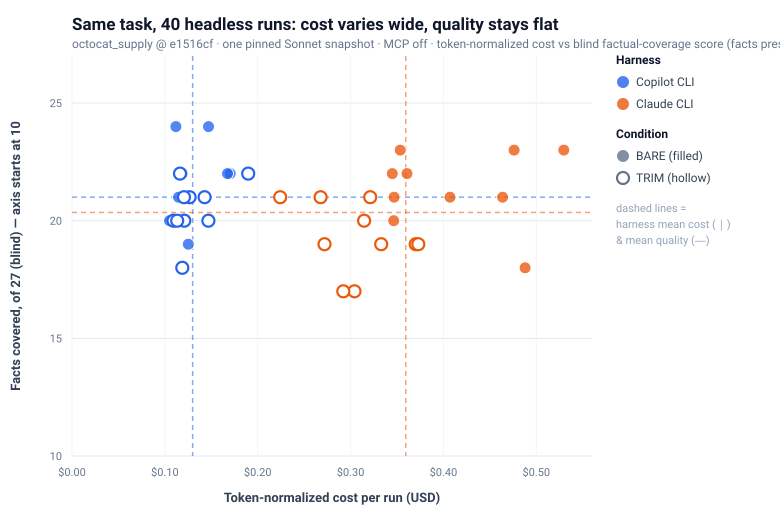

# One run can't rank two coding agents

Developers are seeing a lot of AI coding-agent comparisons right now.

One post says one agent is faster. Another says a different agent is cheaper. A screenshot shows a dramatic difference in token usage or cache behavior. It is tempting to turn those results into a simple ranking.

But coding agents are not just models. They are models plus harnesses: the system prompt, tool orchestration, context loading, memory files, MCP servers, planning behavior, and the workflow around all of that.

That means two agents can use the same underlying model and still behave very differently.

I wanted to understand how much that matters, so I ran a controlled comparison.

Same repo. Same prompt. Same underlying model. Same pinned commit. Same environment constraints. Forty total headless runs.

The cost result was clear: **Copilot CLI delivered similar factual coverage at materially lower token-normalized cost.** Quality was effectively a tie — the gap was under one point on a 27-point rubric — so this is a story about cost, not about one agent being smarter.

But that is not the most important point.

The more important point is that the cost difference came from harness behavior, not magic. For this task, Copilot CLI's strategy was more efficient. For a different task, a different harness strategy could win.

## The experiment

The task was intentionally ordinary: explain a repository to a new developer.

The prompt asked the agent to describe the repo's purpose, main components, data flow, and exactly how to install, run, and test it locally.

To make the comparison as fair as possible, I controlled the obvious variables:

- Same repository
- Same pinned commit
- Same prompt
- Same underlying model
- MCP servers disabled
- Auto-loaded instruction files removed
- Two conditions: one bare repo, one repo with a short memory/instruction file
- Ten repetitions per harness per condition
- Forty total runs
- Token usage, cost, cache behavior, requests, wall-clock time, tool calls, and answer quality captured

Quality was scored using a blind factual-coverage rubric.

The goal was not to prove that one product is universally better. The goal was to see what happens when two coding-agent harnesses face the same task repeatedly.

## What happened

<iframe src="./figures/cost-vs-quality-interactive.html" loading="lazy" scrolling="no" title="Cost vs quality across 40 headless runs — interactive: filter by harness and condition, hover any dot for its run" style="width:100%;height:720px;border:0;display:block;margin:0 0 12px"></iframe>

<noscript>

</noscript>

*Filter by harness and condition above, and hover any dot for its run.*

In these 40 runs, Copilot CLI and Claude CLI landed in a similar quality band, but with a clear cost separation.

### Copilot CLI

- 20 runs
- Cost range: $0.105–$0.190
- Mean cost: $0.130
- Mean quality: 21.0/27

### Claude CLI

- 20 runs
- Cost range: $0.224–$0.530
- Mean cost: $0.359
- Mean quality: 20.4/27

So Copilot CLI cost roughly a third as much, while quality stayed effectively tied — 21.0 versus 20.4 is well inside the run-to-run noise.

And both harnesses shared the same blind spot: all 40 answers repeated a stale port number straight from the README instead of checking the actual config — a failure that owes nothing to which harness you picked, and everything to the context they were given.

That is the small win. But the bigger lesson is more interesting.

## The harness mattered more than the model

Both harnesses used the same underlying model. The repo and prompt were the same. The environment was controlled.

So why did the results differ?

The main difference was how the harnesses approached the work.

Both harnesses made roughly the same number of tool calls — about 13 file and directory reads per run. The difference was packaging. Copilot CLI batched independent reads together, averaging about 4.5 model round-trips. Claude CLI took a more sequential path, averaging about 16. Because every request re-sends the same large shared prefix (around 22k tokens), those extra round-trips — not the model, and not cache efficiency, which was similar on both sides — are the cost gap.

For this repository-explanation task, batching helped.

But this does not mean the same strategy wins every task. A task that requires careful step-by-step debugging, iterative code changes, or reacting to failing tests may reward a different approach.

That is why the conclusion is not:

> Copilot is always the better harness.

The conclusion is:

> Harness design is part of agent effectiveness.

The model matters. But the model is not the whole product.

## Why one run is dangerous

A single run can make a result look cleaner than it really is.

Even with the same prompt, same repo, same model, and same environment, the agents did not behave identically from run to run. They made different tool calls, took different paths, spent different numbers of tokens, and produced slightly different answers.

That is normal for coding agents.

In fact, even when I held every input fixed and simply re-ran the *same* harness, the numbers still moved: cost by up to ~1.6×, wall-clock time by ~1.8×, and tool calls, output, and cache behavior by roughly ~2×. That is the floor of the variation — before any difference between the two harnesses even enters the picture.

If I had picked only one Copilot run and one Claude run, I could have told several different stories depending on which two dots I selected from the chart. In this very dataset, drawing one run from each side at random could make the cost ratio look anywhere from 1.18× to 5.04× — and the quality "winner" could flip to either side.

That is the N=1 trap.

So why do two similar runs differ at all? A gap between two runs can be one of four things:

1. **Randomness** — the same harness varies run to run, as the numbers above show. This is usually the largest single factor.
2. **Your environment** — skills, MCP servers, and memory files change what the model sees before you type a word. They are yours, not the harness's.
3. **Task fit** — a harness strategy that happens to suit *this* task, like the batching above. Real, but task-shaped, and easily copied by any other harness.
4. **Genuine, general superiority** — possible, but a single run cannot show it, and in this controlled sample we saw no sign of it.

The trap is reading reasons 1, 2, or 3 as if they were reason 4.

One run can be useful as a demo. It can start a conversation. But it cannot rank two coding agents.

## What developers should look for instead

When evaluating coding agents, do not only ask which model they use.

Ask:

- How does the harness load context?
- What tools are available to the model?
- Does it batch independent work or proceed step by step?
- How many model round-trips does the task require?
- Are instruction files, memory files, skills, or MCP servers changing the baseline?
- Does higher token spend actually produce better output?
- Was the test repeated enough times to see variation?
- Was quality scored, or only speed and cost?

The useful question is not simply:

> Which agent won?

The useful question is:

> Why did this agent behave the way it did on this task?

## What this means for Copilot

This experiment tested only Copilot CLI on one headless task — not the full Copilot product surface. But it points to a broader lesson that matters for Copilot and every other coding-agent environment.

Copilot is not just one model in one surface. It is a developer experience across editors, GitHub, the CLI, pull requests, issues, repositories, and enterprise workflows.

It can support different models, different surfaces, and different interaction patterns while keeping developers inside a familiar workflow.

That flexibility matters because no single model or harness strategy will win every task.

In this experiment, Copilot CLI came out ahead on cost at no measured cost to quality. But that is one CLI on one task — not proof that Copilot is generally better, and not what this experiment set out to show.

But the durable takeaway is not the scoreboard.

The durable takeaway is that agent effectiveness is a system property. It comes from the model, the harness, the tools, the context, and the workflow working together.

So the next time you see a coding-agent benchmark, do not just ask who won.

Ask what was actually measured.

One run can start a conversation.

It cannot crown a winner.
