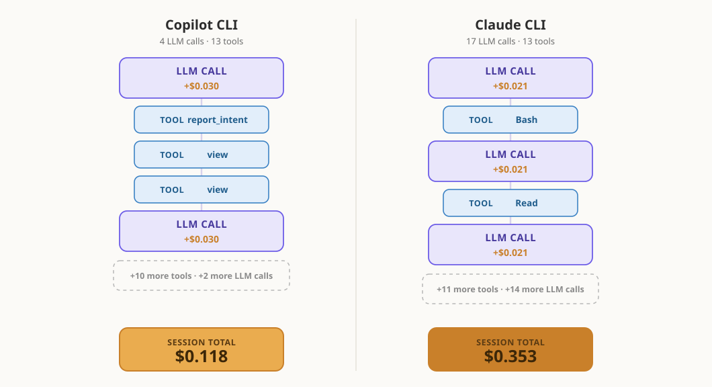

# One run can't rank two coding agents

Developers are seeing a lot of AI coding-agent comparisons right now.

One post says one agent is faster. Another says a different agent is cheaper. A screenshot shows a dramatic difference in token usage or cache behavior. It is tempting to turn those results into a simple ranking.

But coding agents are not just models. They are models plus harnesses: the system prompt, tool orchestration, context loading, memory files, MCP servers, planning behavior, and the workflow around all of that.

That means two agents can use the same underlying model and still behave very differently.

I wanted to understand how much that matters, so I ran a controlled comparison.

Same repo. Same prompt. Same underlying model. Same pinned commit. Same environment constraints. Forty total headless runs.

The result was surprising.

The two harnesses landed in essentially the same quality band, but one did so at a much lower token-normalized cost.

For this particular task, Copilot CLI delivered similar factual coverage at materially lower token-normalized cost. Quality was effectively a tie — the gap was under one point on a 27-point rubric — so this is primarily a story about efficiency, not about one agent being smarter.

But that is not the most important point.

The more important point is that the difference came from harness behavior, not model capability. For this task, Copilot CLI's strategy was more efficient. For a different task, a different harness strategy could easily come out ahead.

## The experiment

The task was intentionally ordinary: explain a repository to a new developer.

The prompt asked the agent to describe the repo's purpose, main components, data flow, and exactly how to install, run, and test it locally.

To make the comparison as fair as possible, I controlled the obvious variables:

- Same repository
- Same pinned commit
- Same prompt
- Same underlying model
- MCP servers disabled
- Auto-loaded instruction files removed
- Two conditions: one bare repo, one repo with a short memory/instruction file
- Ten repetitions per harness per condition
- Forty total runs
- Token usage, cost, cache behavior, requests, wall-clock time, tool calls, and answer quality captured

Quality was scored using a blind factual-coverage rubric.

The goal was not to prove that one product is universally better. The goal was to see what happens when two coding-agent harnesses face the same task repeatedly.

## What happened

<iframe src="./figures/cost-vs-quality-interactive.html" loading="lazy" scrolling="no" title="Cost vs quality across 40 headless runs — interactive: filter by harness and condition, hover any dot for its run" style="width:100%;height:720px;border:0;display:block;margin:0 0 12px"></iframe>

<noscript>

</noscript>

*Filter by harness and condition above, and hover any dot for its run.*

In these 40 runs, Copilot CLI and Claude CLI landed in a similar quality band, but with a clear cost separation.

### Copilot CLI

- 20 runs
- Cost range: $0.105–$0.190
- Mean cost: $0.130
- Mean quality: 21.0/27

### Claude CLI

- 20 runs
- Cost range: $0.224–$0.530
- Mean cost: $0.359
- Mean quality: 20.4/27

So Copilot CLI cost roughly a third as much, while quality stayed effectively tied.

And both harnesses shared the same blind spot: all 40 answers repeated a stale port number straight from the README instead of checking the actual config — a failure that owes nothing to which harness you picked, and everything to the context they were given.

That cost result is the surface-level finding.

The bigger lesson is more interesting.

## Why the cost differed

Both harnesses used the same underlying model. The repo and prompt were the same. The environment was controlled.

So why did the results differ?

Both harnesses made roughly the same number of tool calls — about 13 file and directory reads per run.

The difference was not what they looked at.

The difference was how they organized the work.

Copilot CLI tended to batch independent reads together, averaging about 4.5 model round-trips. Claude CLI took a more sequential path, averaging about 16.

Because every request carries the same large shared prefix — around 22k tokens — those extra round-trips compound quickly. In this dataset, round-trip count explained the cost gap far better than the model itself or cache efficiency, which was similar on both sides.

*One representative run from each harness. Both make about 13 reads at a similar cost per call — the gap is how many calls it took to get there.*

So where did that difference in round-trips come from?

The most likely source is the part of the harness you never see: the system prompt.

Copilot CLI's system prompt tells the model, in plain imperative language, to batch independent tool calls — and even gives it a worked example: if you need to read three files, make three calls in a single response, not three in a row.

Claude CLI's system prompt mentions parallel tool calls too. But it frames them as something the model *can* do rather than *should* do, hedges them with a caveat about dependent steps, and gives no worked example.

Same model. Different default behavior. The wording nudged one harness toward batching and left the other leaning sequential.

For this repository-explanation task, batching worked well.

That is a real product difference.

It is also not a universal ranking.

That product difference is, in the end, a paragraph of system-prompt wording.

Either vendor can rewrite it in the next release. If they do, these numbers can shrink, vanish, or flip.

A task that requires careful debugging, iterative code changes, or reacting to failing tests may reward a different strategy entirely.

This is the key lesson from the experiment.

The conclusion is not:

> Copilot is always the better harness.

The conclusion is:

> Harness design is part of agent effectiveness.

The model matters.

But the model is not the whole product.

## Why one run is dangerous

A single run can make a result look cleaner than it really is.

Even with the same prompt, same repo, same model, and same environment, the agents did not behave identically from run to run. They made different tool calls, took different paths, spent different numbers of tokens, and produced slightly different answers.

That is normal for coding agents.

In fact, even when I held every input fixed and simply re-ran the same harness, the numbers still moved. Cost varied by up to roughly 1.6×, wall-clock time by roughly 1.8×, and tool calls, output, and cache behavior by roughly 2×.

That is the floor of the variation — before any difference between the two harnesses even enters the picture.

If I had picked only one Copilot run and one Claude run, I could have told several different stories depending on which two dots I selected from the chart.

That is the N=1 trap.

So why do two similar runs differ at all?

A gap between two runs can be one of four things:

1. **Randomness** — the same harness varies run to run.
2. **Your environment** — skills, MCP servers, and memory files change what the model sees before you type a word.
3. **Task fit** — a harness strategy that happens to suit this particular task.
4. **Genuine, general superiority** — possible, but a single run cannot demonstrate it.

The trap is reading reasons 1, 2, or 3 as if they were reason 4.

One run can be useful as a demo.

It can start a conversation.

But it cannot rank two coding agents.

## What developers should look for instead

When evaluating coding agents, do not only ask which model they use.

Ask:

- How does the harness load context?
- What tools are available to the model?
- Does it batch independent work or proceed step by step?
- How many model round-trips does the task require?
- Are instruction files, memory files, skills, or MCP servers changing the baseline?
- Does higher token spend actually produce better output?
- Was the test repeated enough times to see variation?
- Was quality scored, or only speed and cost?

The useful question is not simply:

> Which agent won?

The useful question is:

> Why did this agent behave the way it did on this task?

None of this replaces the standard guidance for getting good results from an agent — pick the right model for the job (or let Auto mode choose as a sensible fallback), write precise requests, and give the agent the context and guardrails it needs.

It adds one habit on top:

When you compare two agents, judge the spread across several runs, not a single dot.

## What this means for Copilot

This experiment tested only Copilot CLI on one task.

It does not prove that Copilot is generally better, and it does not prove that this harness strategy is optimal for every workflow.

What it does illustrate is the value of flexibility.

Different tasks reward different behaviors.

Some tasks benefit from aggressive exploration.

Others benefit from tighter planning.

Some reward batching.

Others reward a more sequential approach.

The same is true for models.

A model or harness that performs best for one task may not be the best choice for the next.

That is why access to multiple models and multiple interaction surfaces can be valuable.

Developers are not locked into a single strategy.

They can choose the model and workflow that best fit the task while staying inside a familiar development environment.

In this experiment, Copilot CLI won the round: lower token-normalized cost with no measurable loss in answer quality.

That is useful.

But the durable takeaway is not the scoreboard.

The durable takeaway is that agent effectiveness is a system property.

It comes from the model, the harness, the tools, the context, and the workflow working together.

So the next time you see a coding-agent benchmark, do not just ask who won.

Ask why.

One run can start a conversation.

It cannot crown a winner.
