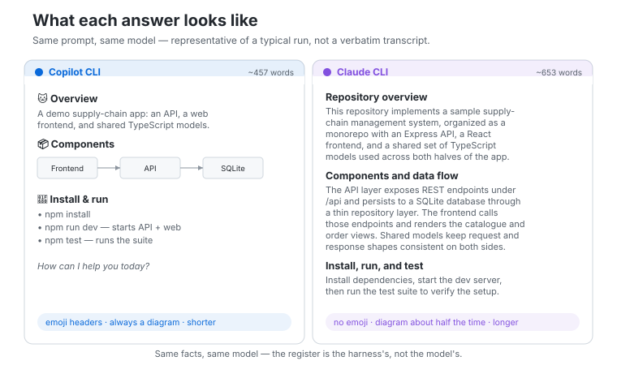
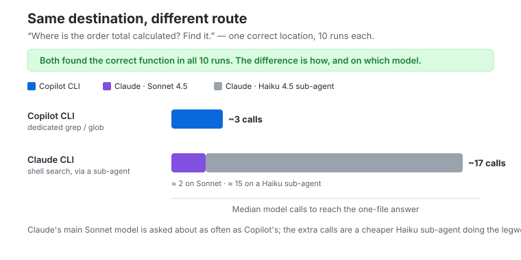
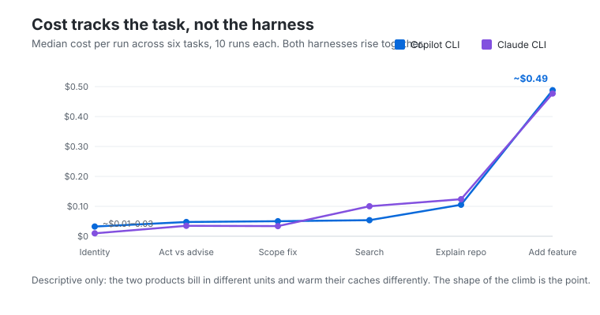
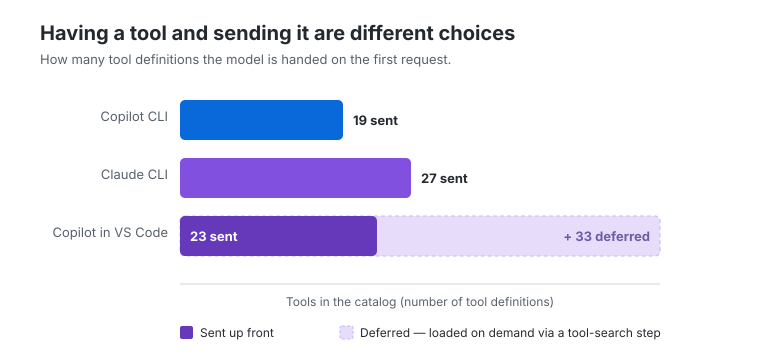

# How harness design shows up in coding-agent behavior

Ask two coding agents to explain the same repository, and their answers can look like the work of two different models.

One opens with emoji section headers, draws a little box-and-arrow diagram of the architecture, and signs off in about 450 words. The other writes closer to 650, almost never reaches for an emoji, and only sometimes bothers with the diagram. Put the two replies side by side and you would happily bet they came from different products, maybe even different model families.

They did not. Underneath both was the same Claude Sonnet 4.5 snapshot, reading the same prompt, in the same repository, at the same commit, from a fresh session with no extra context loaded. The only thing I changed was the harness wrapped around the model — GitHub Copilot CLI on one side, the Claude CLI on the other.

So the house style is not really coming from the model. The harness is doing most of the shaping.

In the previous article I described a coding agent as a model living inside a **harness**: the software that writes its instructions, hands it tools, loads its context, manages its memory, and runs the loop. That piece mapped the parts. This one is about what you can actually *see* when you hold the model still and let those engineering decisions play out, over and over, on real tasks.

The short version is that the harness's fingerprints are easy to spot in some places and nearly invisible in others. They show up most where a task leaves room for choice — how to explain something, how to go looking for an answer, how to organize the work. They fade where the task has exactly one right move.

## How I looked

I ran a small, fixed set of prompts through both command-line agents under matched conditions: the same model snapshot, the same repository pinned to the same commit, a fresh session every time, and MCP switched off so nothing extra crept into the context. Each prompt ran ten times on each harness, so I could talk about tendencies instead of cherry-picking a single run.

The prompts ranged from the trivial (what are you?) to the open-ended (add a feature), with a tightly scoped bug fix, a couple of repository-comprehension tasks, and a focused search task in between. All told, that came to a couple hundred runs across the two CLIs.

A third harness — GitHub Copilot inside the VS Code editor — gets its own section near the end. It has to be looked at differently: its agent mode can't be driven headlessly the way the CLIs can, so that section is a structural look at how it's built rather than a behavioral one.

None of this is meant to crown a winner. It's a look at how design choices surface as behavior.

---

## Fingerprint 1: how the agent talks

The clearest tell turned up on the most ordinary task in the set — *explain this repository to a new developer.* There is no single correct shape for that answer, which is exactly why it lets each harness's habits show. Over ten runs apiece, the two agents were consistently, recognizably different:

| Behavior | Copilot CLI | Claude CLI |
|---|---:|---:|
| Median answer length | 457 words | 653 words |
| Runs containing emoji | 10 of 10 | 3 of 10 |
| Runs with an ASCII component diagram | 10 of 10 | 6 of 10 |

<figure>
  
  <figcaption>
    What the two styles look like on the same prompt — same facts, same model, different register. Illustrative of a typical run.
  </figcaption>
</figure>

This isn't formatting noise. The two harnesses give the model different marching orders, and you can trace the difference back to a single line. The Claude CLI's instructions tell the model to skip emoji unless the user asks for them. Copilot's say nothing of the kind. And the behavior follows: seven of the ten Claude answers were emoji-free, all ten Copilot answers had at least one.

But here is the part I find more interesting, because it complicates the neat story. The instruction didn't win every time.

Three of the ten Claude runs reached for emoji despite the rule, and one of them piled on ten. The instruction moved most of the distribution to zero, but it didn't bolt the door. The base model has a pull toward decorative formatting; one harness leaves that pull alone, the other pushes back — usually with success, not always.

This is an observation, not a controlled result — but it points to a distinction worth holding onto:

> A harness steers the model. It does not overwrite it.

A system prompt isn't a configuration file that sets behavior to a fixed value. It tilts the odds. Brevity told the same story — both harnesses ask for short answers, and both sailed well past their own targets on a task the model evidently felt deserved more room. The guidance moved the average without ever becoming a hard limit.

One last thing from this corner of the data, offered gently because it's only an observation. So far we've watched instructions about *style* — how long to be, whether to decorate. Harnesses also carry instructions about *conduct*: when to act alone versus stop and ask. Those seemed to hold more firmly. Asked a leading "should we improve this?", both agents held back and advised rather than charging in to edit. Whether conduct rules are genuinely more durable than style ones, or this is just how these particular tasks fell, is the kind of claim that would need its own experiment before I'd lean on it.

---

## Fingerprint 2: how the agent goes looking

The strongest result in the whole study came from watching the two agents search a repository — and it traces back to a choice you'd never notice without reading the requests on the wire.

A coding agent can only call the tools its harness hands it. So the harness decides which tools exist, how broadly each one is scoped, how much instruction each definition carries, whether capabilities are bundled together or split apart, and how the whole catalog gets delivered. Those decisions quietly become the agent's working method.

The two toolboxes were not the same size, or the same shape:

| Harness | Native tools | Estimated tool-definition footprint |
|---|---:|---:|
| Copilot CLI | 19 | approximately 8.1k tokens |
| Claude CLI | 27 | approximately 18.9k tokens |

The counts only hint at the design. The Claude CLI pours a lot of behavior into one big `Bash` tool whose description carries pages of usage guidance and safety rules — pick up the shell and you pick up a whole process. Copilot CLI went the other way, splitting terminal work across several smaller tools for starting, reading, listing, and stopping shell processes. Neither is better in the abstract; one is a broad shell with opinions baked in, the other a tidier kit of process-management parts.

But the difference that actually changed behavior was simpler than any of that. One harness shipped dedicated search tools. The other folded search into the shell.

### Same destination, different route

I handed both agents the same small assignment, ten times each:

> Where in this codebase is the order total calculated? Find it.

There's one right answer — a single function, in a single file. Both agents found it in all ten runs, every time, no misses. The model knew the job. What differed was the journey.

Copilot reached for its dedicated `grep` and `glob` tools and went more or less straight there — a median of about **three** calls to the model. The Claude CLI, with no standalone search tool, ran its searches through `Bash` — `rg`, `find`, that sort of thing — and in eight of ten runs handed the digging to a helper sub-agent. That detail matters more than it first looks, because the sub-agent isn't even the same model: it's an *Explore* agent running on the cheaper, faster **Haiku 4.5**, while the main Sonnet agent waits in the background. So Claude's tally comes in two layers — the Sonnet parent made only about **two** calls, much like Copilot, while the Haiku helper made another **fifteen or so**, churning through shell output, for roughly seventeen model calls in all.

<figure>
  
  <figcaption>
    Both reach the destination every time. Claude's main Sonnet model is asked about as often as Copilot's — the extra calls are a cheaper Haiku 4.5 sub-agent doing the legwork.
  </figcaption>
</figure>

Same target, same perfect success rate — two very different routes there. The gap is the abstraction each harness chose to offer. A dedicated search tool packages a common operation into one clean request — *this pattern, in this path, with these filters.* A shell hands the model a general-purpose environment and lets it assemble the search itself, step by step — and Claude's harness leans into that by spinning off a separate, cheaper model to grind through it.

It shows up in the bill, too. A Claude search run cost about twice a Copilot one — roughly ten cents against five — and, against intuition, the cheap Haiku helper is the *bigger* half of that, simply because it makes so many calls. That is the strategy in miniature: push the noisy, repetitive searching onto a cheaper model and keep the expensive one for the reasoning. It also means a raw "Claude made seventeen calls" reads worse than it is, since most of those calls never touched the pricier model.

I don't want to oversell any of this as "fewer calls is better." It isn't a quality score. A single shell command can do more than a narrow search call, and a more exploratory, one-step-at-a-time path can sometimes react more carefully to what it finds. The honest takeaway is narrower, and more interesting:

> The same model, given a different toolbox, organizes the same task in a completely different way.

---

## Fingerprint 3: what an agent can do versus what it does

It's tempting to describe a coding agent by its most impressive capabilities — sub-agents, skills, persistent memory, planning modes, background tasks, web access. But a capability sitting in the toolbox is a different thing from a capability in use, and the gap between them turned out to be a finding of its own.

On the everyday tasks, the sub-agent machinery went completely untouched — not once. But on the open-ended search, broad enough to be worth handing off, the Claude CLI delegated to a sub-agent in eight of ten runs. The capability had been there the whole time. The shape of the task decided whether the model ever reached for it.

> A capability surface tells you what *can* happen, not what usually does.

The same held for the rest of the advanced kit. Planning tools, task graphs, skills, web access — all present in the captured surface, most of them never called on these tasks. That doesn't make them dead weight; it means these particular jobs didn't ask for them.

Skills and memory follow the same pattern, with one twist worth keeping honest. Each harness surfaces them differently — behind an on-demand tool, as a catalog of names pasted into the opening context, as lazy entries loaded on reference — and across these tasks none of it was actively called. But a catalog sitting in the context shapes the model whether or not a tool ever fires, so "never invoked" isn't quite "never mattered."

---

## Where the fingerprint fades

If the story stopped there, you might conclude the harness drives everything. It doesn't — and the clearest evidence is the task where the two agents became almost indistinguishable.

One experiment planted an off-by-one bug in a pagination function and described the symptom precisely: it returns one item too many. There's really only one correct move. And both harnesses made it, run after run — a single line changed, nothing else touched: no unrelated files, no extra comments, no speculative tests bolted on. The flourishes that separated them on the explain-the-repo task simply had nowhere to go.

On a tightly specified task, the harness has little room to leave a fingerprint. The shared model and the narrow constraints take over. That's the boundary the whole article is really about: harness differences are loud on open-ended work and quiet when the task pins down the answer.

It's also the cleanest reply to anyone waving a single run as proof that one agent is smarter. On the task with one right answer, they landed in the same place. The differences that looked so dramatic lived in presentation and in route — not in whether the work got done.

Cost tells the same story, since that's where these comparisons usually start. Plot what each task cost on both harnesses and the striking thing isn't the gap between them — it's how closely they move together. The price climbed with the task, from a couple of cents on the trivial questions to real money on the open-ended feature, and the two agents climbed it side by side.

<figure>
  
  <figcaption>
    The task set the bill far more than the harness did: both agents' costs rise together as the work opens up.
  </figcaption>
</figure>

So the task, not the harness, mostly decided what a run cost — the gap between the two agents stays small next to how much the task itself moves the number. I won't push it further than that: the products bill in different units and warm their caches differently from run to run, so this is the shape of the curve, not a verdict on which is cheaper. Article 1 covers run-to-run variance, and a later piece takes on cost versus quality directly.

---

## The same vendor, a different machine

So far that's two harnesses from two vendors. The sharpest illustration that harness design is a *choice* comes from holding the vendor fixed too.

GitHub ships Copilot both as a command-line tool and as an agent inside the VS Code editor. Same company, the same Claude Sonnet model underneath — and yet the two are built so differently that, read side by side, they look like the work of rival teams. I can't put the editor version through the repeated headless protocol the CLIs allow, so what follows is a look at the wiring, not a set of behavioral rates. The wiring alone is telling.

Start with the system prompt. The CLI's reads like a terminal autopilot: work non-interactively, don't stop to ask, keep the answer to a hundred words. The editor's is a different document with different priorities — it tells the model to call itself "GitHub Copilot," to implement changes rather than suggest them, to keep a running to-do list for multi-step work, and, tellingly, to *never say the name of a tool to the user*. One prompt is written for someone watching a terminal scroll; the other for someone watching files change in an editor.

The editor also writes itself into the instructions. The CLI's prompt is mostly about the task; the editor's is shot through with the editor — use absolute file paths, never edit a file by running a terminal command, prefer the IDE's own rename and find-references tools, open a browser to check a UI change. The harness's sense of *where it is* — inside a workspace, not at a bare shell — is part of what the model reads before it does anything.

And the toolbox is delivered differently. Both CLIs hand the model their whole catalog up front, every schema on every request. The editor can't comfortably do that, because it has far more to offer — 56 tools in the setup I captured, nearly a third of them contributed by installed extensions. So it virtualizes: it keeps a smaller set active and defers the rest behind a tool-search step, pulling a schema in only when the model reaches for it.

<figure>
  
  <figcaption>
    A bigger catalog need not mean a bigger active tool set. The two CLIs send everything; the editor keeps 23 tools active and holds 33 back behind a tool-search step.
  </figcaption>
</figure>

None of this is better or worse than the CLI's design — it's what the *editor* demands. A terminal harness can assume a shell and little else; an editor harness lives inside a workspace full of files, extensions, and UI, and its prompt and its toolbox both bend to fit. That is the whole argument, sharpened to a point: the same model, and even the same vendor, produce a completely different machine once the surface around them changes.

---

## What this means when you compare agents

A single output really can tell you something true. It can show you a house style, a preferred way of searching, a leaning toward batching or working step by step, whether the agent delegates, which capabilities it leaves on the shelf. Those are real product differences, and they're worth noticing.

What a single output can't tell you is which agent is better in general, because the very same decision that helps one task can hurt the next. Dedicated search tools trim the steps on a routine lookup; a broad shell might be the better instrument for a stranger investigation. A heavier system prompt buys more consistent behavior and spends context to do it, and still won't suppress every habit the model brought with it. A sub-agent is a gift on sprawling, open-ended work and pure overhead on a one-line fix.

So the useful question isn't *which agent looked smarter.* It's *which harness decision produced this behavior, and did that decision suit the task in front of me?* When you're sizing up a coding agent, that turns into a handful of concrete things to look at: what tools it exposes, how it delivers them, how it nudges the model to search and organize work, which of its fancier capabilities actually fire on your kind of task, and how much room the task left for any of that to matter.

The model supplies the capability. The harness shapes how that capability is presented, organized, and constrained. And the task decides how much room those choices ever get to show.
