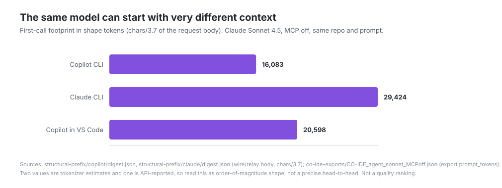
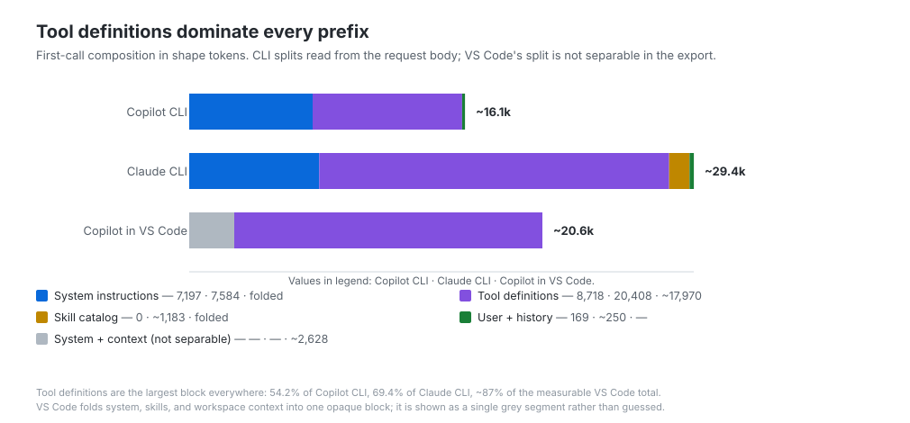
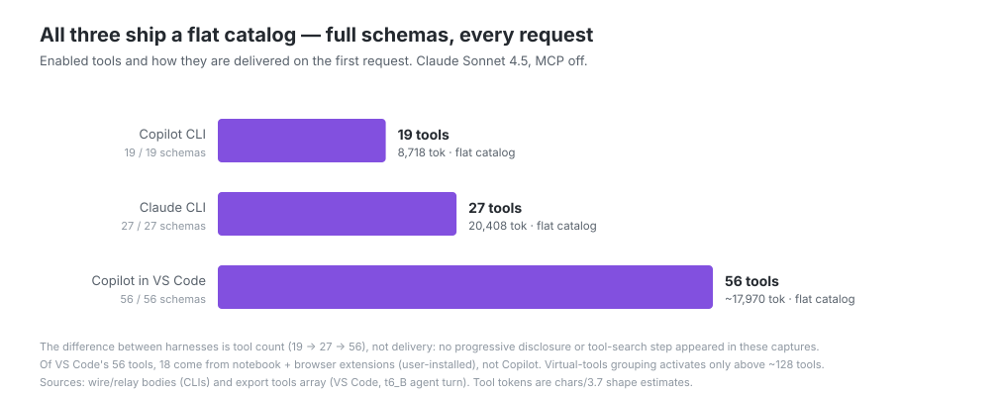
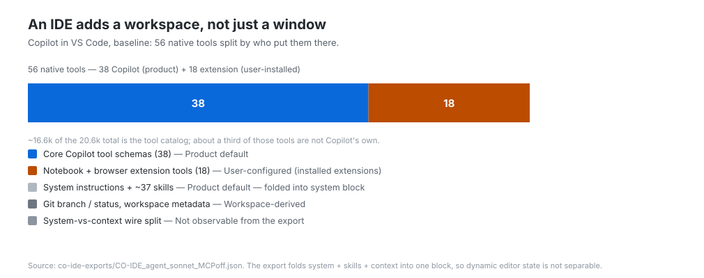
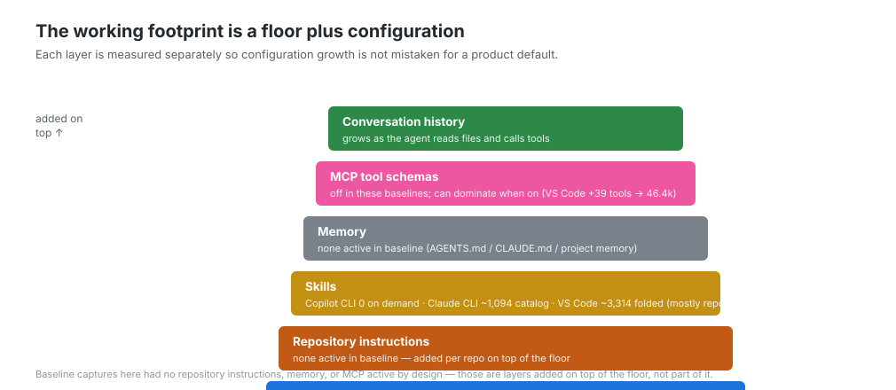
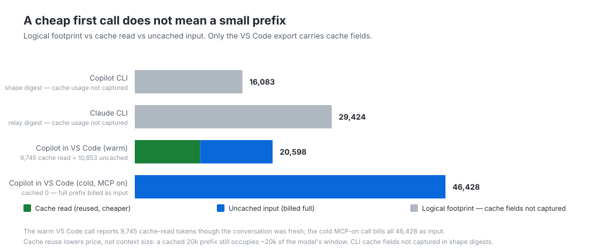

# The prompt you type is not the prompt the model sees

A developer types:

> Explain this repository to a new developer.

That looks like a short prompt.

But before the coding agent can answer, the model may already have received thousands—or tens of thousands—of tokens describing its role, its tools, the current workspace, repository instructions, memory, skills, permissions, and previous conversation state.

The text in the chat box is only one part of the request.

In the previous article in this series, I described a coding agent as a model operating inside a **harness**: the software that assembles context, exposes tools, executes tool calls, manages memory, and organizes the work.

This article looks at one specific part of that system:

> What does each environment send to the model before useful task work begins?

To answer that, I captured the first main-agent request from several coding-agent environments using the same model, repository, and minimal prompt. The goal was not to rank the products. It was to make the invisible context visible.

The result is a useful way to think about coding agents:

> Before the model reasons about your task, the harness has already decided what world the model is operating in.

---

## First, this is not the model’s context window

The term **context window** usually refers to the maximum amount of information a model can process in one request.

That is not what I am measuring here.

I use **first-call context footprint** to describe the logical input already present on the first main-agent request:

```text
System instructions
+ native tool definitions
+ environment and workspace context
+ repository instructions
+ memory and skills
+ the user’s message
= first-call context footprint
```

This footprint consumes part of the model’s available context before the agent reads files, runs commands, or starts accumulating conversation history.

A larger footprint is not automatically bad. It may give the model better instructions, richer workspace awareness, or more capabilities.

A smaller footprint is not automatically good. It may provide less guidance or require additional discovery later.

The useful questions are:

- What is in the footprint?
- Which parts are stable?
- Which parts are optional?
- Which parts are cached?
- What benefit does each part provide?
- How much room remains for the task?

---

## The experiment: measure the clean floor first

A configured developer environment can contain MCP servers, project instructions, skills, memory, extensions, and accumulated session state.

That is realistic, but it makes product comparisons hard to interpret.

So the first step is to measure a **baseline harness floor**.

For each environment, the intended baseline is:

- the same model snapshot
- the same repository and pinned commit
- the same minimal prompt
- a fresh conversation
- MCP disabled
- no optional user-installed skills
- no repository instruction or memory file
- no previous conversation history
- the first main-agent request only

The environments included in this investigation are:

- GitHub Copilot CLI (headless)
- Claude CLI (headless)
- GitHub Copilot in Visual Studio Code (Agent mode)

This article deliberately compares **three** environments, all running the same
model snapshot (Claude Sonnet 4.5, `claude-sonnet-4-5-20250929`). A fourth surface
(Claude Code in VS Code) was captured separately but is out of scope here, so that
every number below comes from one consistent model and capture family.

All three captures use the same repository (`octodemo/octocat_supply`), the same
minimal task prompt, and MCP off.

### The normalized first-call metric

Every value below is the **first-call context footprint (shape tokens)**: a
`chars / 4` estimate of the serialized first main-agent request body
(system instructions + tool definitions + messages), measured on the first
`claude-sonnet` request and excluding auxiliary calls (title generation, routing,
`gpt-4o-mini` helpers).

These are **shape** numbers, not billed token counts. Two caveats follow from how
each environment was captured, and they matter for honest comparison:

- **Copilot CLI** and **Claude CLI** footprints are estimated from the *literal
  request body* (wire capture for Copilot CLI, relay capture for Claude CLI), so
  their system / tools / messages split is directly observable.
- **Copilot in VS Code** is captured from a Copilot Chat export that exposes the
  API-reported `prompt_tokens` total and the tools array, but **not** a clean
  system-vs-tools wire split. For that surface the total is API-reported and the
  tool-definition figure is a `chars / 4` estimate of the tools array; the
  remaining split is marked *not separately observable*.

Because one total is API-reported and two are tokenizer-style estimates, treat the
table as **order-of-magnitude shape**, not a precise head-to-head.

| Environment | First-call context footprint | Measurement source |
|---|---:|---|
| Copilot CLI | **~14,877 tokens** | `structural-prefix/copilot/digest.json` (wire body, chars/4) |
| Claude CLI | **~27,217 tokens** | `structural-prefix/claude/digest.json` (relay body, chars/4) |
| Copilot in VS Code | **20,598 tokens** | `co-ide-exports/CO-IDE_agent_sonnet_MCPoff.json` (export `prompt_tokens`) |

<figure>
  
  <figcaption>
    The same model can begin with a different amount of context depending on the harness and surface. Final values must use one normalized metric.
  </figcaption>
</figure>

The chart should not be read as a quality ranking.

It establishes something simpler:

> The model name can remain constant while the context assembled around it changes substantially.

---

## Where the tokens go

A total is useful, but the composition explains more.

For each first request, I separate the context into these categories:

| Component | What it contains |
|---|---|
| System instructions | Role, policies, autonomy, output style, tool-use guidance |
| Native tools | Names, descriptions, parameters, and JSON schemas |
| Environment context | Operating system, working directory, shell, IDE state |
| Repository context | Branch, status, commit, workspace metadata, instructions |
| Skills and memory | Reusable guidance, project memory, prior facts |
| User message | The prompt entered by the developer |
| Existing history | Previous messages, summaries, and tool results |

The desired comparison is a stacked bar chart using the same categories for each environment.

Shape tokens (`chars / 4` of the actual wire/relay body). "—" means the component
is not separately measurable in that capture.

| Environment | System | Tools | Environment | Skills | User message + history | Total |
|---|---:|---:|---:|---:|---:|---:|
| Copilot CLI | 6,657 | 8,064 | <150 (in system) | 0 (loaded on demand) | 156 | ~14,877 |
| Claude CLI | 7,015 | 18,877 | ~300 (in first msg) | ~1,094 (in first msg) | 1,325 | ~27,217 |
| Copilot in VS Code | — (not separable in export) | ~16,622 (tools array, chars/4) | — | ~3,314 — 16 skills + 8 agents folded into system (mostly repo/installed-ext) | — | 20,598 (API total) |

For the two CLI surfaces the split is read directly from the request body. For
Copilot in VS Code the export gives the **total** (`prompt_tokens` = 20,598) and the
tools array (56 tools, `chars / 4` ≈ 16,622) but folds system instructions, skills,
and workspace context into one opaque block, so those rows are left unattributed
rather than guessed.

> Note on the Copilot-in-VS-Code total: of its 56 native tools, **18 come from
> notebook and browser extensions**, not Copilot itself (~3.9k tokens by `chars / 4`).
> Strip those and the product floor is closer to **~17k tokens**. The 20,598 figure
> is the as-measured catalog, not the bare Copilot floor.

<figure>
  
  <figcaption>
    The total footprint matters, but its composition explains which design and configuration choices created it.
  </figcaption>
</figure>

In the captures collected here, the developer’s actual prompt was a very small part of the request — on the order of tens of tokens against a 15k–27k prefix.

In all three captures the **single largest component was the tool definitions**: 54.2% of the Copilot CLI prefix, 69.4% of the Claude CLI prefix, and an estimated ~16.6k of the 20.6k Copilot-in-VS-Code total. System instructions were the next largest block (roughly 6.7k–7.0k tokens on the two CLIs). The user message and conversation history were the smallest measurable parts.

That observation changes how we should interpret prompt advice.

Making a 30-token user prompt five tokens shorter may have little effect when the harness already carries a large fixed prefix. Improving the prompt may still reduce discovery and round-trips, but the saving does not come mainly from shortening the words the developer typed.

---

## Tool definitions are context

A coding agent needs descriptions of the tools it may call.

A tool definition can include:

- its name
- a natural-language description
- parameter descriptions
- required and optional fields
- a JSON schema
- examples or restrictions

This is useful guidance for the model. It is also part of the prompt.

For every environment, the investigation should record:

| Environment | Enabled tools | Full schemas on first request | Tool-definition tokens |
|---|---:|---:|---:|
| Copilot CLI | 19 | 19 / 19 (flat) | 8,064 |
| Claude CLI | 27 | 27 / 27 (flat) | 18,877 |
| Copilot in VS Code | 56 (38 Copilot + 18 extension) | 56 / 56 (flat) | ~16,622 (chars/4 of tools array) |

Tool counts and full schemas are read directly from the request body for the two
CLIs and from the export's `tools` array for Copilot in VS Code. The
Copilot-in-VS-Code tool-definition figure is a `chars / 4` estimate; the others are
the digest's own `chars / 4` shape numbers. A more detailed description may help it select the correct tool and construct valid arguments.

But there are possible costs:

- a larger fixed prefix
- more choices for the model to evaluate
- duplicated or overlapping tools
- irrelevant capabilities in simple tasks
- greater cache-creation cost when the catalog changes

This is not evidence that fewer tools are always better.

It is evidence that tool design is part of agent design.

---

## How tools are delivered is also a design choice

Two harnesses can expose the same capabilities without presenting them to the model in the same way.

Possible strategies include:

- sending every full tool schema on every request
- sending a smaller active set
- grouping tools
- advertising tools by name and description
- loading schemas after a search or selection step
- changing the active catalog as the task evolves

These strategies trade prompt size against immediacy and complexity.

A flat catalog gives the model direct access to everything. A deferred approach can reduce the initial footprint but may add another selection step or hide useful capabilities until requested.

This article reports the observed strategy for each environment from the reconciled wire, relay, and export captures.

| Environment | First-request delivery strategy | Evidence |
|---|---|---|
| Copilot CLI | Flat — 19 full schemas on every request | Wire body: 19/19 schemas present, constant catalog |
| Claude CLI | Flat — 27 full schemas on every request | Relay body: 27/27 schemas present, constant catalog |
| Copilot in VS Code | Flat — 56 full schemas on every request | Export (`t6_B` agent turn): 56/56 carried full `input_schema`; no deferral observed |

In every captured Sonnet run, all three environments ship a **flat catalog**: full
descriptions and JSON schemas for every enabled tool, on every request. None used
progressive disclosure, name-only advertising, or a tool-search step in these
captures. The differences are in tool **count** (19 → 27 → 56), not delivery.

<figure>
  
  <figcaption>
    The harnesses differ in how many tools they enable, not in how they deliver them: every one ships a flat catalog in these captures.
  </figcaption>
</figure>

> One caveat for Copilot in VS Code: it has a documented "virtual tools" grouping
> feature that activates only above ~128 enabled tools. No capture here triggered
> it, so this article cannot show virtualization empirically — at 56 tools the
> catalog was still flat.

> Tool capability and tool delivery are different things.

Counting enabled tools alone does not tell us how much context the model receives.

---

## The IDE adds a workspace, not just a window

An IDE integration can provide information that a terminal harness may need to discover through tools.

Depending on the product and configuration, the IDE may inject:

- workspace folders
- active file and selection
- open editors
- language and project metadata
- git branch and status
- recent commits
- diagnostics
- repository instructions
- available agents or modes
- editor permissions and settings

This context can improve grounding.

For example, knowing the active file or current branch may save an exploratory tool call. Diagnostics can point the model directly toward a failing line. Repository metadata can help the agent understand project boundaries.

But the context has tradeoffs:

- it occupies part of the model’s context capacity
- it may be irrelevant to the current task
- it can change between requests and reduce cache stability
- it can make an IDE capture structurally different from a CLI capture

The comparison should therefore distinguish:

1. **Harness instructions**
2. **Native tool definitions**
3. **IDE-injected workspace context**
4. **User or repository configuration**

Do not attribute all additional IDE context to the harness itself. Some of it comes from the current workspace and some from optional configuration.

In the Copilot-in-VS-Code capture (the one IDE surface in this article), the largest
single block was still the **tool catalog** — 56 native tools, ~16.6k tokens by
`chars / 4` — and **18 of those 56 tools came from notebook and browser extensions**,
not Copilot. That is the clearest example of the attribution point: a large chunk of
the "IDE footprint" is *user-installed extension surface*, not a product default.

| IDE component | Attribution |
|---|---|
| Core Copilot tool schemas (38) | Product default |
| Notebook + browser extension tools (18) | User-configured (installed extensions) |
| System instructions + skill/agent catalog (16 skills + 8 agents) | Mostly repo `.github` + installed extensions (folded into system) |
| Git branch / status, workspace metadata | Workspace-derived |
| `prompt_tokens` system-vs-context split | Not observable from the export |

The export does not expose a clean wire split, so finer attribution (exact dynamic
editor state vs static instructions) is *not observable* here and is left unstated
rather than estimated.

<figure>
  
  <figcaption>
    A large share of the "IDE footprint" is user-installed extension surface, not a product default.
  </figcaption>
</figure>

This is why “IDE versus CLI” is not a neutral change of interface.

The model may be operating with a different information set before the task begins.

---

## Skills, memory, and instructions create another layer

Even with MCP disabled, optional context can enter through:

- `AGENTS.md`
- `CLAUDE.md`
- Copilot instruction files
- project memory
- user memory
- skills
- reusable prompt blocks
- generated plans or summaries

Products may implement these mechanisms differently.

Some may preload full instruction bodies. Others may inject only names and descriptions and retrieve the full content when needed. Some memory may persist across sessions; other memory may be scoped to one task.

The first step is to establish a baseline with optional context removed.

The second is to measure each addition separately:

```text
Baseline harness floor
+ repository instructions
+ skills
+ memory
+ MCP tools
+ conversation history
= configured working footprint
```

<figure>
  
  <figcaption>
    Product defaults establish the floor. Repository and user configuration add layers on top of it.
  </figcaption>
</figure>

This separation prevents a common benchmarking mistake: comparing a richly configured environment with a clean one and attributing the difference entirely to the product.

In these baselines, skills and memory behaved differently across the three environments:

- **Copilot CLI** carried **zero skill blocks** in the prefix. It exposes a `skill`
  tool (~741 tokens) that loads skill content on demand, so skills cost almost
  nothing until invoked.
- **Claude CLI** preloaded a **13-skill catalog** (~1,094 tokens) into the first user
  message — names and short descriptions, not full bodies. The full skill text is
  retrieved only when a skill runs.
- **Copilot in VS Code** folded a **16-skill + 8-agent catalog** (~3,314 tokens of
  descriptions) into the system prompt, counted inside the opaque system block rather
  than itemized. Their `<file>` paths show the origin: only 6 are Copilot built-ins —
  **9 come from the workspace repo's `.github/` (skills + sub-agents) and 8 from
  user-installed extensions**. So most of this segment is repository and user config the
  IDE preloads, not a product default.

None of the three baselines had a repository instruction file (`AGENTS.md`,
`CLAUDE.md`, or Copilot instructions) or project memory active, by design — those are
configuration layers measured on top of the floor, not part of it.
---

## Cold, warm, and cached are different measurements

A first user-visible request is not always a fully cold request.

A stable system prompt or tool catalog may already be available in a provider’s prompt cache. That can cause the first observed call to report cache-read tokens even though the user has just opened a fresh conversation.

This creates three related but different quantities:

### Logical context footprint

Everything the model receives and can attend to.

### Cache creation

Tokens written into a reusable prompt cache.

### Cache read

Tokens reused from an existing cache at a lower price.

These categories affect cost differently, but cache reuse does not remove information from the context.

A 30k-token cached prefix still occupies roughly 30k tokens of model context even if it is inexpensive to reuse.

For every baseline capture, report:

| Environment | Logical footprint | Cache creation | Cache read | Uncached input |
|---|---:|---:|---:|---:|
| Copilot CLI | ~14,877 (shape) | not captured (shape digest) | not captured | not captured |
| Claude CLI | ~27,217 (shape) | not captured (relay digest) | not captured | not captured |
| Copilot in VS Code | 20,598 (API `prompt_tokens`) | — | 9,745 (warm capture) | 10,853 |

The cache picture is **partially observable** and the honest answer differs by source:

- The two CLI structural digests reconstruct the prefix *shape* (`chars / 4` of the
  request body) and **do not carry the response `usage` cache fields**, so cache
  creation / read / uncached are not available for them here.
- The Copilot-in-VS-Code export *does* carry `prompt_tokens_details`. The MCP-off
  capture reports `prompt_tokens` = 20,598 with `cached_tokens` = 9,745 — but it was
  taken **warm** (after a warm-up turn), so that cache read reflects reuse, not a cold
  first call. A separate MCP-on capture taken cold (`cached_tokens` = 0) reported
  46,428 tokens, confirming the prefix is real input even when later reads are cheap.

This is exactly why a first user-visible request is not always a cold request.

<figure>
  
  <figcaption>
    Cache reuse changes price, not context size. A cached prefix still occupies the same room in the model's window.
  </figcaption>
</figure>

> “The first call is cheap, so the prefix must be small.”

and:

> “The prefix is large, so it must be billed at full input price every time.”

Both can be wrong.

---

## How much context remains for the task?

The baseline footprint consumes part of the model’s maximum context capacity.

A simplified calculation is:

```text
Nominal model context limit
- first-call logical footprint
- output or reasoning reservation
= approximate room remaining for task context
```

The result is only approximate because products may reserve output tokens, use hidden reasoning budgets, compact history, or apply limits below the model’s theoretical maximum.

Still, it is useful to show the order of magnitude. All three environments run Claude Sonnet 4.5, whose nominal context window is **200,000 tokens**.

| Environment | Model context limit | First-call footprint | % of window consumed | Approximate room remaining |
|---|---:|---:|---:|---:|
| Copilot CLI | 200,000 | ~14,877 | ~7.4% | ~185,000 |
| Claude CLI | 200,000 | ~27,217 | ~13.6% | ~173,000 |
| Copilot in VS Code | 200,000 | 20,598 | ~10.3% | ~179,000 |

These "room remaining" figures intentionally ignore output and reasoning
reservations, which are **not reliably documented per harness** in these captures.
The point is the order of magnitude: even the largest baseline (~27k on Claude CLI)
leaves the great majority of a 200k window for task work. The first-call footprint is
a real but modest tax on capacity — its more interesting cost is attention and
cache-stability, not running out of room.

A larger baseline may prevent later discovery, while a smaller one may grow quickly as the agent reads files.

The number becomes useful when paired with the next question:

> Did the additional context improve the task enough to justify the space it occupied?

That requires repeated behavioral experiments, not a structural snapshot.

---

## Baseline and configured environments answer different questions

There are two valid ways to inspect a coding agent.

### Baseline harness floor

This isolates product defaults:

- no MCP
- no optional skills
- no repository memory
- minimal prompt
- fresh session

It answers:

> What does this product bring before I configure it?

### Configured working environment

This reflects real usage:

- MCP servers
- repository instructions
- skills
- memory
- extensions
- active workspace context
- ongoing conversation

It answers:

> What does my actual environment send?

Both are useful. They should not be mixed into one ranking.

A configured environment may have a much larger footprint because it can do more. That is not automatically inefficiency. It is a capability bundle.

A clean baseline may be smaller but unable to perform the same work.

The most useful report shows both:

| Environment | Baseline floor (MCP off) | Configured footprint | Added capabilities |
|---|---:|---:|---|
| Copilot CLI | ~14,877 | not captured in this set | — |
| Claude CLI | ~27,217 | not captured in this set | one small MCP server added +14 tools / ~1,876 tok in a separate probe |
| Copilot in VS Code | 20,598 | 46,428 (cold, MCP on) | +39 `mcp__bicep/github/pylance` tools → 95 flat tools total |

Only one environment here has a clean, matched configured snapshot: turning MCP on in
Copilot in VS Code more than doubled the prefix (20,598 → 46,428) by adding 39 MCP
tools to the flat catalog. That is not "the product got heavier" — it is **the
developer's configuration** piling onto the product floor. The CLI configured cells
are left blank rather than filled with a value captured under different conditions.
---

## What this analysis can—and cannot—tell us

The first-call footprint is a structural measurement.

It can tell us:

- how much context is present before task work begins
- which components dominate
- which capabilities are exposed
- how tools are represented
- what comes from the IDE
- what comes from user configuration
- how much of the prefix is cached

It cannot, by itself, tell us:

- which agent produces better code
- which agent is cheaper over a complete task
- whether a larger prefix prevents later exploration
- whether detailed tool schemas improve selection
- whether memory improves or harms quality
- whether an IDE needs fewer later model calls
- which product is best overall

Those questions require repeated tasks, quality scoring, and matched configurations.

This article is intentionally not that benchmark.

Its purpose is to make the starting conditions visible.

---

## A practical checklist for comparing coding-agent environments

Before comparing two environments, record:

### Product identity

- product and surface
- exact version
- extension identifier
- endpoint or proxy
- model and exact snapshot

### Baseline configuration

- repository and commit
- exact prompt
- fresh-session procedure
- MCP servers
- skills
- memory
- repository instructions
- enabled tools

### First-request structure

- logical first-call footprint
- system-instruction tokens
- tool-definition tokens
- environment and workspace tokens
- instruction, memory, and skill tokens
- user-message tokens
- unattributed tokens

### Tool delivery

- enabled tool count
- full schemas present
- deferred or indexed tools
- catalog-expansion behavior
- auxiliary requests

### Cache state

- uncached input
- cache creation
- cache read
- cache formula and source fields

### Limits

- model context capacity
- product-specific limit
- maximum output
- reasoning reservation
- compaction behavior

If those details are missing, a difference in cost or quality may come from configuration rather than from the harness being evaluated.

---

## The prompt box is the tip of the context

A developer sees one prompt.

The model sees a constructed environment.

That environment can include instructions, tools, workspace state, memory, skills, MCP schemas, and accumulated history before the agent performs its first useful action.

The harness decides how that environment is assembled.

The IDE contributes additional workspace context.

The user and repository add configuration on top.

That is why two products using the same model can begin the same task from very different starting points.

And it is why the next time someone says one coding agent “used more context,” the right response is not immediately that it was better or worse.

The right questions are:

> What was in that context?

> Who added it?

> Was it useful?

> And what tradeoff did it create?
